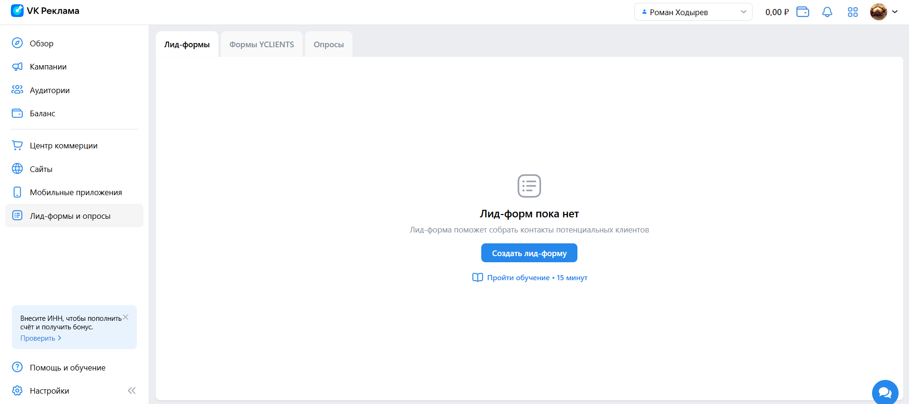
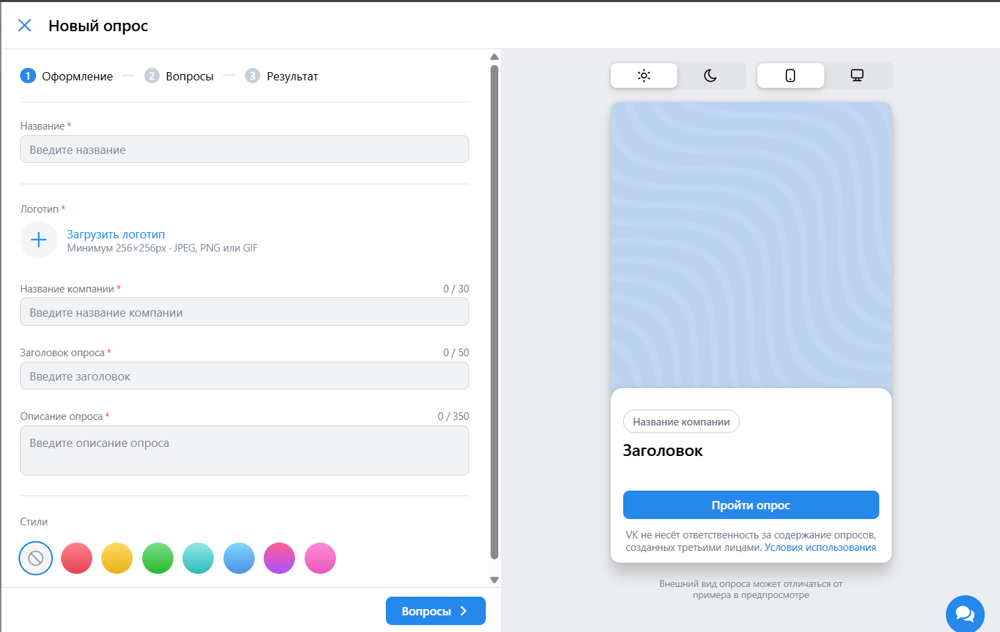
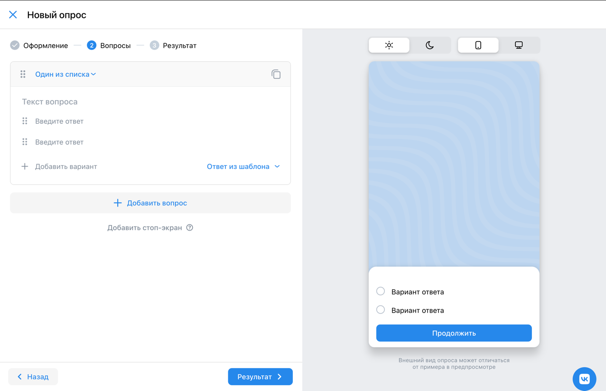
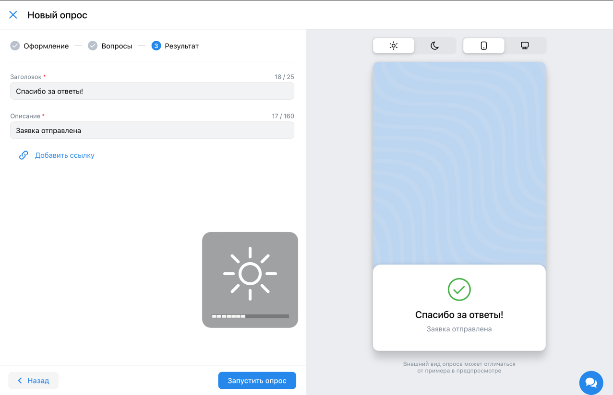
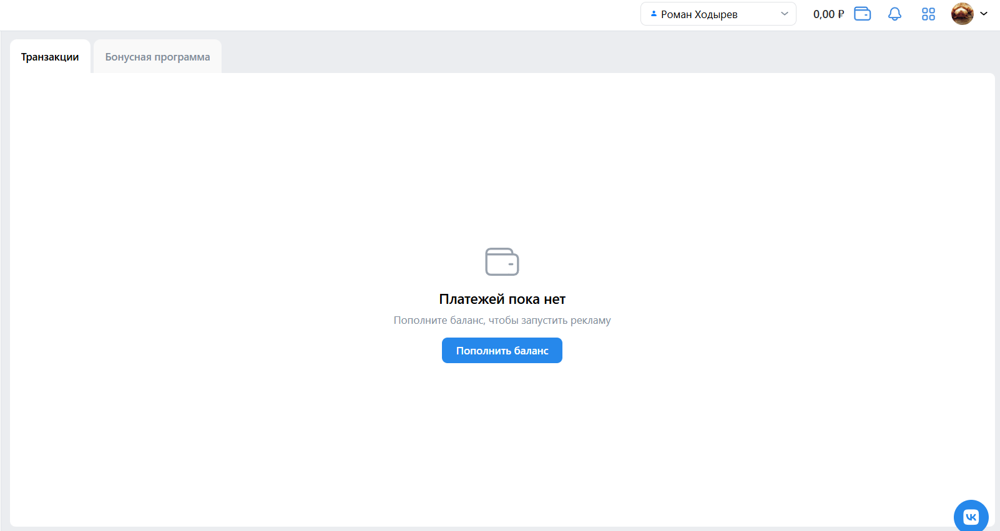
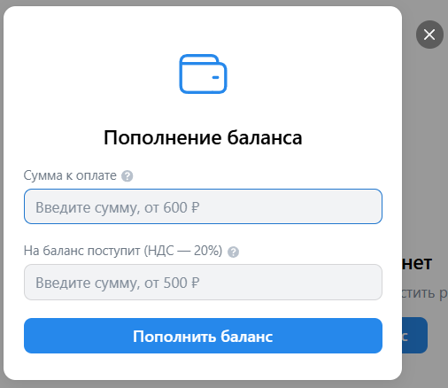
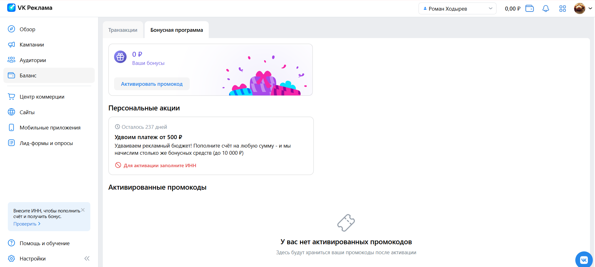
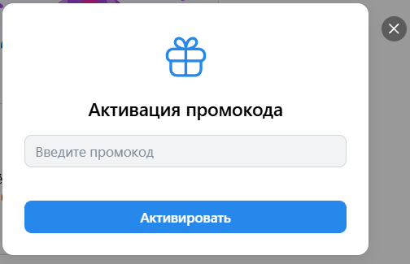

# 1/4 чек-листа команды Fight Club для сайта [ads.vk.com](ads.vk.com)

---

# Содержание

- [Лид-формы и опросы](#лид-формы-и-опросы)
- [Баланс](#баланс)

---

# Лид-формы и опросы

URL: https://ads.vk.com/hq/leadads/leadforms

- При выборе сверху "Лид-формы" или "Опросы" появляется окно со списком всех соответсвующих типов реклам. Если таких нет, отображены кнопки "Создать лид-форму" ("Создать опрос") и ссылка на прохождение обуения (если обучение не было пройдено прежде).
- При нажатии на кнопку "Создать лид-форму" ("Создать опрос") открывается окно оформления
- При выборе "Формы YCLIENTS" появляется окно с возможностью перейти в YCLIENTS, а также поле для того, чтобы вставить код оттуда.
- При нажатии на кнопку "Перейти в YCLIENTS" происходит редирект на страницу [YCLIENTS](https://yclients.com/e/mp_7405_vk_ads/).
- При вставке кода из YCLIENTS в соответствующее поле справа и нажатии на стрелочку происходит интеграция с филиалом YCLIENTS. Если интеграция не найдена, в левом нижнем углу появится соответствующее сообщение.

Рассмотрим создание нового вида рекламы (лид-формы или опроса) на примере опроса.

## Опросы

### Оформление.

- При клике на кнопку "Создать опрос" открывается страница модальное окно с названием "Новый опрос", полем "Название", "Название компании", "Заголовок опроса", "Описание опроса".
- При выборе цветного кружка изменяется стиль опроса на соответствующий цветовой оттенок.
- При клике на кнопку "Загрузить логотип" происходит открытие нового модального окна с возможностью выбора логотипа из ранее загруженных, а также с возможностью загрузки нового логотипа непосредственно с устройства.
- При клике на месяц тело карточки становится темным.
- При клике на солнце тело карточки становится светлым.
- При клике на крест модального окна - окно закрывается.
- При клике на кнопку "Вопросы" происходит переход на страницу вопросов создаваемого опроса.

### Вопросы.

- При вводе значений во все поля для ввода, загрузке логотипа минимум 256x256px формата JPEG, PNG или GIF и клике на кнопку "Вопросы" открывается окно.
- Окно имеет заголовок "Вопросы" и содержит кнопки: Добавить вариант, Добавить вопрос, Ответ из шаблона, Добавить стоп-кран, Один из списка.
- При клике на кнопку "Назад" открывается предыдущая страница с введенными до этого значениями.
- Лид-формы и опросы. Опросы. Оформление. Вопросы. При клике на кнопку "Результат" появляется сообщение "Вопрос должен быть не пустым и содержать минимум 2 ответа". При клике на крест модального окна - окно закрывается.
- При клике на кнопку "Добавить вариант" появляется новое поле "Введите ответ" и рядом с ним появляется крест. При клике на крест появившееся поле удаляется.
- При клике на кнопку "Добавить вопрос" добавляется новый вопрос. При клике на корзину вопрос удаляется.
- При клике на крест модального окна - окно закрывается.

### Вопросы. Добавить стоп-экран.

- При клике на кнопку "Добавить стоп-экран" добавляется стоп экран с полями: "Завершить опрос, если ответ на", "содержит любой из", "Заголовок экрана", "Описание".
- При клике на крест появившееся поле удаляется.
- После ввода символов в текст вопроса и два поля вариантов ответа и клике на кнопку "Результат" - открывается страница "Результат" с двумя заполненными по умолчанию полями "Заголовок" с телом "Спасибо за ответы!" и "Описание" с телом "Заявка отправлена", а также кнопкой "Добавить ссылку".

### Результат.

- При очистке данных полей и клике на кнопку "Запустить опрос" у каждого поля появляется сообщение "Обязательное поле".
- При клике на "Добавить ссылку" появляется поле "Ссылка".
- При клике на "Запустить опрос" закрывается модальное окно "Новый опрос". Отображается таблица опросов. В данной таблице отображается последний созданный опрос с именем, равным введенному при создании.

# Баланс

- На странице показана история транзакций кабинета. Если транзакций не было, то на странице есть кнопка "Пополнить баланс"
- При нажатии на иконку кошелька или сумму, указанную слева от него, или на кнопку "Пополнить баланс" открывается модальное окно с возможностью пополнения баланса

## Пополнение

- При нажатии вне модального окна или на крестик в правом верхнем углу, модальное окно закроется
- В первое поле с надписью "Сумма" необходимо ввести стоимость, на которую вы желаете пополнить баланс
- При изменении первого поля, второе поле также будет заполняться с учетом 20% НДС. Так, если ввести в верхнее поле 600 ₽, то в нижнем появится 500 ₽.
- При изменении нижнего поля, верхнее также изменится с учетом 20% НДС. Так, если ввести в нижнее поле 500 ₽, то в верхнем значение изменится на 600 ₽.
- Если поля оставить пустыми, то при нажатии на кнопку "Пополнить баланс" верхнее поле станет красным и попросит ввести корректную сумму.
- При наведении курсора на знак вопроса всплывает окно с подсказкой, откуда можно перейти на страницу с условиями оферты
- Если все правильно заполнено, то при нажатии на кнопку "Пополнить баланс" произойдет пополнение баланса на указанную в нижнем поле сумму с привязанной к кабинету карты

## Бонусная программа

- Вверху страницы показано количество бонусов на аккаунте. При нажатии на кнопку "Активировать промокод" всплывает модальное окно с активацией промокода.
- В разделе "Персональные акции" указаны персональные акции рекламодателя и возможность их применения. Также указан срок действия акций.
- В разделе "Активированные промокоды" указаны все ранее активированные промокоды

- При нажатии вне модального окна или на крестик в правом верхнем углу, модальное окно закроется
- Если ввести верный промокод и нажать на кнопку "Активировать", то промокод применится, и он отобразится в истории промокодов ниже на этой же странице.
- Если ввести неверный промокод, то поле станет красным и появится сообщение "Неверный промокод"
